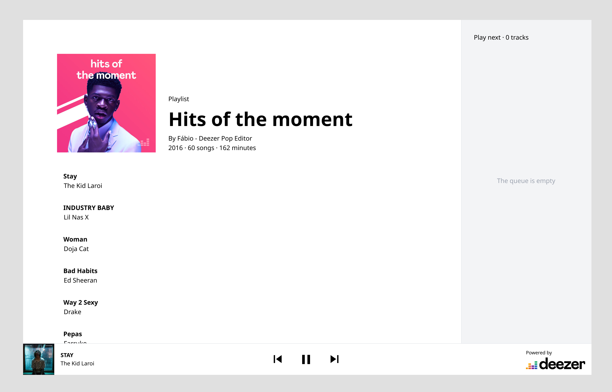

# Prerequisites

- [Node 16](https://nodejs.org/en/download/) (LTS)

> We suggest you to use a version manager like [nvm](https://github.com/nvm-sh/nvm) to switch versions more easily.

# HTML & CSS

The idea of this lab is to practice with HTML and CSS by implementing a responsive web page based on a provided mockup.


## Objectives

Complete the HTML and CSS files in the `public` directory to make it look as the provided [Mockup](https://www.figma.com/file/J4VbVpfdcSPxtVzi94dTD5/Music-player?node-id=56%3A107).



## Rules

- CSS Frameworks are not allowed for this exercise.
- The `<main>` tag as well as all existing `id` attributes should not be changed because they are used for testing. 
- Follow all the rules mentioned in the [Style guide](https://www.figma.com/file/J4VbVpfdcSPxtVzi94dTD5/Music-player?node-id=91%3A115) and [Guidelines](https://www.figma.com/file/J4VbVpfdcSPxtVzi94dTD5/Music-player?node-id=56%3A266): Colors, Typography, dimensions, spacing and positioning.
- The font and the normalized css have already been created and added to the index.html
- Please ask for help if you are stuck on a problem.

## Submission and Corrections

- We have set up some tests to check if your page is corresponding to the mockup.


## Local development setup
### Install dependencies

```sh
npm install
```

### Run

Although you can directly open the [index.html](public/index.html) file with your browser and start coding, we advise you to use a development server such as [live-server](https://www.npmjs.com/package/live-server), which is a little development server written in Node.js with live reload capability.

Everything is already setup for you in [the package.json](package.json). To start the development server, you just need to run the following command:
```sh
npm run dev
```

Once started, the server will serve the files in the `public` directory and automatically reload the browser when you save any file.

### Run tests

> Make sure your development server has started before running tests.

We have made some tests with the library [cypress](https://www.cypress.io/).

You can locally run them with:
```sh
npm run cypress:open
```

To run them without opening the browser (headless testing):
```shell
npm run cypress:run
```

It's recommended to test your layout with Chrome or Chromium to ensure you use the same browser as the one that will be used in the CI (it's Chromium in the CI) to verify your submission.

## Resources

- The Fonts used in the mockup have been loaded from https://fonts.google.com
- CSS Reference https://developer.mozilla.org/en-US/docs/Web/CSS/Reference
- HTML 5 sementic elements https://www.w3schools.com/html/html5_semantic_elements.asp

___

Happy coding 🤓 !
